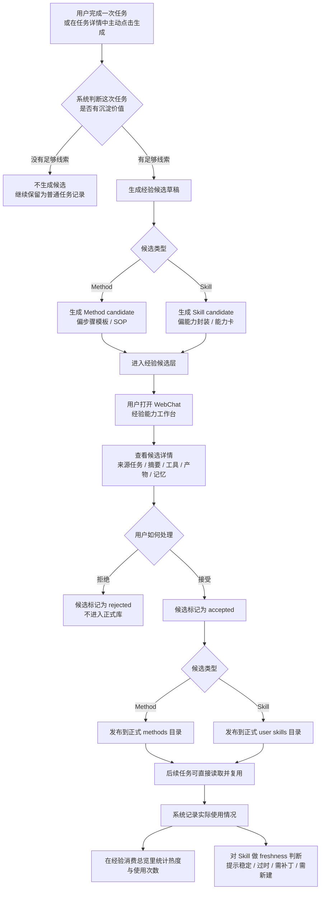

# 经验能力生成机制

本文用用户视角说明 Star Sanctuary 中“经验能力”相关功能的作用、效果、操作路径，以及 `Method` / `Skill` 自动生成的大致工作方式。

---

## 1. 这套功能在解决什么问题

这套功能要解决的不是“这次能不能做”，而是：

- 这次做成的事情，下次能不能更快复用
- 这次踩过的坑，下次能不能少走弯路
- 哪些做法已经稳定，值得沉淀为正式能力
- 哪些能力已经变旧、该补丁、该升级、甚至该新建

它会把一次真实任务里的有效做法，先整理成“经验候选”，再由用户决定是否转为正式资产。

简单理解：

- `Method`：更像“做事说明书”或“步骤模板”
- `Skill`：更像“能力包”或“专长卡”
- `经验能力工作台`：就是这些候选经验的查看、审核、发布、复盘入口

---

## 2. 用户能得到什么效果

从使用效果上看，这套功能会带来下面几件事：

- 系统不会每次都从零开始，而是会逐步积累“做类似事情的成熟套路”
- 成功经验会先形成草稿，等你确认后再变成正式 `Method` 或 `Skill`
- 失败经验、限制条件、适用边界也会一起被保留下来，而不是只记成功结果
- 你能看到哪些经验只是候选，哪些已经正式发布
- 你还能看到哪些能力后来真的被用上了，哪些已经老化或暴露缺口

换句话说，这不是单纯的“记忆”，而是把记忆进一步整理成可复用的能力资产。

---

## 3. Method 和 Skill 的区别

### Method 是什么

`Method` 更偏向“以后这类事怎么做更稳”。

它通常会包含：

- 什么时候适合用这套方法
- 推荐步骤顺序
- 关键检查点
- 常见失败原因
- 相关产物和参考资源

它更像 SOP、操作手册、经验步骤卡。

### Skill 是什么

`Skill` 更偏向“系统以后具备怎样的一套稳定能力”。

它通常会包含：

- 适用范围
- 输入和输出预期
- 决策路由
- 能用哪些工具
- 什么情况下不要乱用

它不是单个步骤，而是一整类问题的处理方式封装。

### 一句话区分

- `Method` 解决“下次最好怎么走”
- `Skill` 解决“下次该用什么能力方式来接”

---

## 4. 用户操作路径流程图

下面这张图按用户实际操作路径，把“生成候选 -> 审核 -> 发布 -> 后续复用”的主流程串起来。

---

## 5. 用户在界面里会怎么用

前端主入口是 WebChat 左侧的 `经验能力`。

里面可以看到三块：

### 5.1 能力获取

这是待处理草稿的快速入口。

你会看到：

- 当前有哪些 `Method Draft`
- 当前有哪些 `Skill Draft`
- 每条草稿都可以直接查看详情、打开来源任务、接受并发布、或者拒绝

适合处理“刚生成出来、还没整理过”的候选。

### 5.2 经验候选

这是完整候选列表。

你可以：

- 搜索标题、摘要、任务 ID、标识
- 按类型筛选 `Method` / `Skill`
- 按状态筛选 `draft` / `accepted` / `rejected`
- 查看每条候选的来源任务、摘要、发布时间、相关产物、相关记忆

适合做复盘和精细审阅。

### 5.3 经验消费总览

这是“这些经验后来到底有没有用上”的总览。

它会帮助你看：

- 哪些 `Method` 被高频使用
- 哪些 `Skill` 被高频使用
- 哪些经验只是生成了，但后续几乎没被用过
- 哪些 `Skill` 已经出现老化、缺补丁、或需要新建的信号

---

## 6. 候选是怎么来的

这套机制有两条主要入口。

### 6.1 普通任务完成后自动沉淀

当一次任务完成后，系统会先判断它值不值得沉淀。

只有具备一定“真实执行痕迹”的任务，才更容易被沉淀，比如：

- 有明确结果
- 有复盘或总结
- 用过工具
- 产出了文件或其他结果
- 关联了记忆或上下文资源

如果满足条件，系统会自动尝试生成：

- `Method` 候选
- `Skill` 候选

默认是“先生成草稿，不自动转正”。

### 6.2 用户主动从任务里生成

除了自动沉淀，用户也可以在任务详情里主动触发：

- 生成 `method candidate`
- 生成 `skill candidate`

适合下面这种情况：

- 这次任务其实很有价值，但自动门槛没触发
- 你想手动把某条历史任务提炼成经验资产
- 你已经知道这次流程值得沉淀，不想等系统自己判断

### 6.3 长期任务 / Goal 也有一条生成线

对长期任务来说，系统还会从整个推进过程里总结建议：

- 完成度高、步骤稳定、证据充分的节点，更容易形成 `Method` 建议
- 暴露出能力缺口、多工具协同、多人协作、执行偏差大的节点，更容易形成 `Skill` 建议

所以：

- 普通任务线更像“从一次实战里提炼经验”
- 长期任务线更像“从持续推进里归纳稳定打法和能力缺口”

---

## 7. 系统不会无脑生成

这套功能有几个明显的收口机制。

### 7.1 先查重

在生成前，系统会先检查：

- 是否已经有重复候选
- 是否已经有高度相似的候选

用户看到的效果是：

- 如果发现重复项，通常会直接打开旧候选，而不是重复造一个
- 如果发现相似项，会提醒你，决定是否继续生成新的

这样可以避免经验库越积越乱。

### 7.2 先停在候选层

默认自动生成只会进入 `experience_candidates` 候选层，不会直接发布到正式 `methods/` 或 `skills/`。

这样做的好处是：

- 自动化能持续工作
- 但正式能力仍保留人工把关

### 7.3 发布前做结构检查

在候选被接受并发布前，系统还会检查草稿结构是否完整。

如果核心章节缺失，就不会让它直接进入正式库。

这能减少“半成品经验”污染正式资产。

---

## 8. 接受、拒绝之后会发生什么

### 8.1 接受 Method 候选

如果接受的是 `Method` 候选：

- 候选状态会变成 `accepted`
- 它会被写入正式 `methods` 目录
- 以后系统可以像读取方法论文档一样复用它

### 8.2 接受 Skill 候选

如果接受的是 `Skill` 候选：

- 候选状态会变成 `accepted`
- 它会被写入正式 `skills` 目录
- 之后会出现在技能检索和技能列表里，成为真正可发现、可复用的能力

### 8.3 拒绝候选

如果拒绝：

- 候选会保留审核结果
- 不进入正式能力库
- 这样以后复盘时仍然知道“它被看过，但没有通过”

---

## 9. 发布后系统还会继续追踪

这套功能不是“发布完就结束”，它还会继续观察这些正式能力后来的实际表现。

### 9.1 记录使用情况

当系统后续真的读取某个 `Method` 或使用某个 `Skill` 时，会记录：

- 是哪个任务用了它
- 用的是哪种经验资产
- 是否与某个候选来源关联

这会形成“经验消费记录”。

### 9.2 做经验消费总览

于是你可以看到：

- 哪些方法最常被拿来用
- 哪些技能最常被调用
- 哪些能力几乎不再被用

这能帮助你判断哪些资产真的有价值。

### 9.3 判断 Skill Freshness

系统还会专门判断 `Skill` 的“新鲜度”。

用户视角下，它大致会提示四类状态：

- `healthy`：目前稳定
- `warn_stale`：开始显老，值得关注
- `needs_patch`：需要补丁或修订
- `needs_new_skill`：已经暴露出新的能力缺口，可能该新建一个 Skill

这能避免技能库只增不修，越堆越旧。

---

## 10. 配置层面的默认行为

当前默认配置体现的是“半自动沉淀”思路：

- 允许自动生成经验候选
- 允许分别自动生成 `Method` 和 `Skill` 草稿
- 默认仍先停留在候选层
- 是否要求用户确认生成、是否要求确认发布，都可以单独配置

对普通用户来说，可以把它理解为：

- 默认会帮你写草稿
- 要不要更保守，取决于你是否开启“生成前确认”或“发布前确认”

---

## 11. 用户最容易理解的一句话总结

这套“经验能力生成机制”，本质上是在把系统从“会聊天、会做事”，推进到“会积累做事经验、会把经验整理成正式能力、会持续淘汰旧能力”。

如果只用一句话概括：

> 它让系统把一次次真实任务，逐步沉淀成以后可复用的做事方法和能力资产。

---

## 12. 关键代码定位

如果后续要继续看实现，建议从下面这些入口开始：

- 经验候选生成主逻辑：`packages/belldandy-memory/src/experience-promoter.ts`
- 任务完成后自动沉淀、候选接受、经验使用记录：`packages/belldandy-memory/src/manager.ts`
- 自动沉淀门槛规则：`packages/belldandy-memory/src/task-auto-promotion-policy.ts`
- 经验相关 RPC：`packages/belldandy-core/src/server-methods/memory-experience.ts`
- 前端经验能力工作台：`apps/web/public/app/features/experience-workbench.js`
- Skill 发布逻辑：`packages/belldandy-skills/src/skill-publisher.ts`
- Method 读取并记录使用：`packages/belldandy-skills/src/builtin/methodology/read.ts`
- Skill 使用记录：`packages/belldandy-skills/src/builtin/skills-tool.ts`
- Goal 侧 Method 建议生成：`packages/belldandy-core/src/goals/method-candidates.ts`
- Goal 侧 Skill 建议生成：`packages/belldandy-core/src/goals/skill-candidates.ts`

---

## 13. 附：更偏实现视角的链路摘要

如果从实现链路压缩成一句流程，大致是：

1. 任务完成或用户主动触发生成。
2. 系统判断是否有足够证据沉淀经验。
3. 先查重，再生成 `Method` / `Skill` 候选草稿。
4. 草稿进入 `experience_candidates`。
5. 用户在 `经验能力工作台` 中查看、接受或拒绝。
6. 接受后发布到正式 `methods/` 或 `skills/`。
7. 后续真实使用会被记录，并进入使用统计与 `Skill Freshness` 判断。

