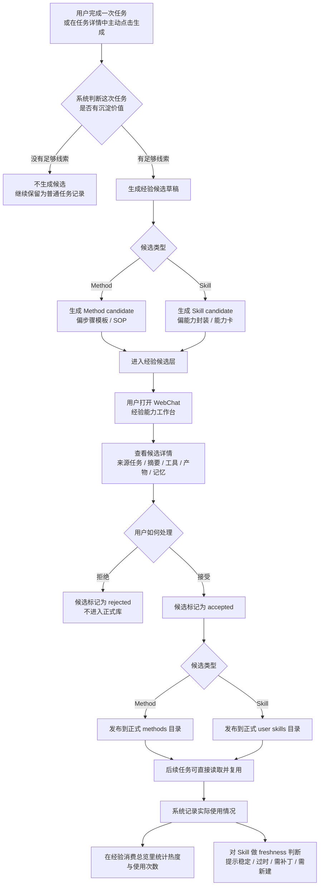

# 经验能力生成机制

本文用用户视角说明 Star Sanctuary 中“经验能力”相关功能的作用、效果、操作路径，以及 `Method` / `Skill` 自动生成的大致工作方式。

---

## 1. 这套功能在解决什么问题

这套功能要解决的不是“这次能不能做”，而是：

- 这次做成的事情，下次能不能更快复用
- 这次踩过的坑，下次能不能少走弯路
- 哪些做法已经稳定，值得沉淀为正式能力
- 哪些能力已经变旧、该补丁、该升级、甚至该新建

它会把一次真实任务里的有效做法，先整理成“经验候选”，再由用户决定是否转为正式资产。

简单理解：

- `Method`：更像“做事说明书”或“步骤模板”
- `Skill`：更像“能力包”或“专长卡”
- `经验能力工作台`：就是这些候选经验的查看、审核、发布、复盘入口

---

## 2. 用户能得到什么效果

从使用效果上看，这套功能会带来下面几件事：

- 系统不会每次都从零开始，而是会逐步积累“做类似事情的成熟套路”
- 成功经验会先形成草稿，等你确认后再变成正式 `Method` 或 `Skill`
- 失败经验、限制条件、适用边界也会一起被保留下来，而不是只记成功结果
- 你能看到哪些经验只是候选，哪些已经正式发布
- 你还能看到哪些能力后来真的被用上了，哪些已经老化或暴露缺口

换句话说，这不是单纯的“记忆”，而是把记忆进一步整理成可复用的能力资产。

---

## 3. Method 和 Skill 的区别

### Method 是什么

`Method` 更偏向“以后这类事怎么做更稳”。

它通常会包含：

- 什么时候适合用这套方法
- 推荐步骤顺序
- 关键检查点
- 常见失败原因
- 相关产物和参考资源

它更像 SOP、操作手册、经验步骤卡。

### Skill 是什么

`Skill` 更偏向“系统以后具备怎样的一套稳定能力”。

它通常会包含：

- 适用范围
- 输入和输出预期
- 决策路由
- 能用哪些工具
- 什么情况下不要乱用

它不是单个步骤，而是一整类问题的处理方式封装。

### 一句话区分

- `Method` 解决“下次最好怎么走”
- `Skill` 解决“下次该用什么能力方式来接”

---

## 4. 用户操作路径流程图

下面这张图按用户实际操作路径，把“生成候选 -> 审核 -> 发布 -> 后续复用”的主流程串起来。

---

## 5. 用户在界面里会怎么用

前端主入口是 WebChat 左侧的 `经验能力`。

里面可以看到三块：

### 5.1 能力获取

这是待处理草稿的快速入口。

你会看到：

- 当前有哪些 `Method Draft`
- 当前有哪些 `Skill Draft`
- 每条草稿都可以直接查看详情、打开来源任务、接受并发布、或者拒绝

适合处理“刚生成出来、还没整理过”的候选。

### 5.2 经验候选

这是完整候选列表。

你可以：

- 搜索标题、摘要、任务 ID、标识
- 按类型筛选 `Method` / `Skill`
- 按状态筛选 `draft` / `accepted` / `rejected`
- 查看每条候选的来源任务、摘要、发布时间、相关产物、相关记忆

适合做复盘和精细审阅。

### 5.3 经验消费总览

这是“这些经验后来到底有没有用上”的总览。

它会帮助你看：

- 哪些 `Method` 被高频使用
- 哪些 `Skill` 被高频使用
- 哪些经验只是生成了，但后续几乎没被用过
- 哪些 `Skill` 已经出现老化、缺补丁、或需要新建的信号

---

## 6. 候选是怎么来的

这套机制有两条主要入口。

### 6.1 普通任务完成后自动沉淀

当一次任务完成后，系统会先判断它值不值得沉淀。

只有具备一定“真实执行痕迹”的任务，才更容易被沉淀，比如：

- 有明确结果
- 有复盘或总结
- 用过工具
- 产出了文件或其他结果
- 关联了记忆或上下文资源

如果满足条件，系统会自动尝试生成：

- `Method` 候选
- `Skill` 候选

默认是“先生成草稿，不自动转正”。

### 6.2 用户主动从任务里生成

除了自动沉淀，用户也可以在任务详情里主动触发：

- 生成 `method candidate`
- 生成 `skill candidate`

适合下面这种情况：

- 这次任务其实很有价值，但自动门槛没触发
- 你想手动把某条历史任务提炼成经验资产
- 你已经知道这次流程值得沉淀，不想等系统自己判断

### 6.3 长期任务 / Goal 也有一条生成线

对长期任务来说，系统还会从整个推进过程里总结建议：

- 完成度高、步骤稳定、证据充分的节点，更容易形成 `Method` 建议
- 暴露出能力缺口、多工具协同、多人协作、执行偏差大的节点，更容易形成 `Skill` 建议

所以：

- 普通任务线更像“从一次实战里提炼经验”
- 长期任务线更像“从持续推进里归纳稳定打法和能力缺口”

---

## 7. 系统不会无脑生成

这套功能有几个明显的收口机制。

### 7.1 先查重

在生成前，系统会先检查：

- 是否已经有重复候选
- 是否已经有高度相似的候选

用户看到的效果是：

- 如果发现重复项，通常会直接打开旧候选，而不是重复造一个
- 如果发现相似项，会提醒你，决定是否继续生成新的

这样可以避免经验库越积越乱。

### 7.2 先停在候选层

默认自动生成只会进入 `experience_candidates` 候选层，不会直接发布到正式 `methods/` 或 `skills/`。

这样做的好处是：

- 自动化能持续工作
- 但正式能力仍保留人工把关

### 7.3 发布前做结构检查

在候选被接受并发布前，系统还会检查草稿结构是否完整。

如果核心章节缺失，就不会让它直接进入正式库。

这能减少“半成品经验”污染正式资产。

---

## 8. 接受、拒绝之后会发生什么

### 8.1 接受 Method 候选

如果接受的是 `Method` 候选：

- 候选状态会变成 `accepted`
- 它会被写入正式 `methods` 目录
- 以后系统可以像读取方法论文档一样复用它

### 8.2 接受 Skill 候选

如果接受的是 `Skill` 候选：

- 候选状态会变成 `accepted`
- 它会被写入正式 `skills` 目录
- 之后会出现在技能检索和技能列表里，成为真正可发现、可复用的能力

### 8.3 拒绝候选

如果拒绝：

- 候选会保留审核结果
- 不进入正式能力库
- 这样以后复盘时仍然知道“它被看过，但没有通过”

---

## 9. 发布后系统还会继续追踪

这套功能不是“发布完就结束”，它还会继续观察这些正式能力后来的实际表现。

### 9.1 记录使用情况

当系统后续真的读取某个 `Method` 或使用某个 `Skill` 时，会记录：

- 是哪个任务用了它
- 用的是哪种经验资产
- 是否与某个候选来源关联

这会形成“经验消费记录”。

### 9.2 做经验消费总览

于是你可以看到：

- 哪些方法最常被拿来用
- 哪些技能最常被调用
- 哪些能力几乎不再被用

这能帮助你判断哪些资产真的有价值。

### 9.3 判断 Skill Freshness

系统还会专门判断 `Skill` 的“新鲜度”。

用户视角下，它大致会提示四类状态：

- `healthy`：目前稳定
- `warn_stale`：开始显老，值得关注
- `needs_patch`：需要补丁或修订
- `needs_new_skill`：已经暴露出新的能力缺口，可能该新建一个 Skill

这能避免技能库只增不修，越堆越旧。

---

## 10. 配置层面的默认行为

当前默认配置体现的是“半自动沉淀”思路：

- 允许自动生成经验候选
- 允许分别自动生成 `Method` 和 `Skill` 草稿
- 默认仍先停留在候选层
- 是否要求用户确认生成、是否要求确认发布，都可以单独配置

对普通用户来说，可以把它理解为：

- 默认会帮你写草稿
- 要不要更保守，取决于你是否开启“生成前确认”或“发布前确认”

---

## 11. 拟新增：能力合成功能（设计方案）

这一节描述的是拟新增功能，目标是先把产品设计讲清楚，暂时不讨论具体代码实现细节。

### 11.1 为什么要加“合成”

当前 `Method Draft` 和 `Skill Draft` 已经能稳定生成，也已经具备接受、拒绝等处理能力。

但在真实使用里，会出现两个很明显的问题：

- 同一类事情会反复产出多个相似草稿
- 单条草稿的信息量常常偏少，不足以支撑一个高质量 `Method` 或 `Skill`

尤其是工具调用、通用执行套路、相似问题处理路径这类场景，很容易在候选层堆出一批“方向差不多、表达略有差异”的草稿。

所以这里新增的不是“替代当前机制”的新系统，而是在现有机制之上补一层：

- 让用户能从某一条草稿出发
- 把同类、近似草稿先聚出来
- 再调用主模型，把多条零散草稿综合整理成一个更完整的新草稿

### 11.2 这次设计遵守的边界

为了不破坏现有链路，这个功能遵守下面几个原则：

- 只在 `draft` 候选层增加“合成”能力，不改变现有接受、拒绝、发布流程
- `Method` 只和 `Method Draft` 合成，`Skill` 只和 `Skill Draft` 合成，不跨类型混合
- 合成入口放在 `能力获取` 页面现有草稿卡片上，不新增新的一级导航
- 合成时调用主模型，而不是沿用草稿批量生成时可能使用的较轻模型
- 合成结果默认仍然是一个新的 `draft` 候选，后续继续走现有审批与发布机制
- 合成结果草稿需要在卡片表现上与普通草稿区分开，例如使用更显眼的高价值视觉样式
- 被检索到的原始草稿默认不自动改状态，避免误处理已有候选

这样可以保证：

- 现有自动生成机制不需要推倒重来
- 现有审批通过 / 拒绝逻辑不需要改成另一套概念
- 新功能是“增强草稿整理能力”，而不是“改写经验能力体系”

这里补充一个表现层约定：

- 合成产出的新草稿，仍然属于 `draft`
- 但在 `能力获取` 和 `经验候选` 中，建议使用特殊卡片样式区分
- 例如金色、鎏金、重点高亮一类的视觉语言，让用户一眼能看出它是“合成稿”而不是普通单任务草稿

这样既不改变状态机，也能让用户明显感知这个草稿的价值层级更高、信息来源更多。

### 11.3 用户入口怎么呈现

入口放在 WebChat 的：

- `内容管理`
- `经验能力`
- `能力获取`

这个页面里本来就分成两块：

- `Method Draft`
- `Skill Draft`

本方案是在这两块里的每一张草稿卡片上，新增一个按钮：

- `合成`

也就是说，用户在看到某条草稿时，不只是可以：

- `查看详情`
- `打开任务`
- `接受并发布`
- `拒绝`

还可以直接点：

- `合成`

### 11.4 用户操作流程

用户视角下，流程应当是这样的：

1. 用户在 `Method Draft` 或 `Skill Draft` 某张草稿卡片上点击 `合成`。
2. 系统以这张草稿为“起点草稿”，自动检索所有同类型的 `draft` 候选。
3. 系统从这些同类型草稿里，找出与当前草稿“同类”或“近似”的那一批候选。
4. 页面弹出一个“合成窗口”，先把检索统计结果展示给用户看。
5. 用户确认后，点击 `合成方法` 或 `合成技能`。
6. 系统调用主模型，阅读这批被检索出来的相似草稿信息。
7. 主模型按照 `Method` 或 `Skill` 的既有生成规范，重新编写出一个新的、更完整的草稿。
8. 新草稿回到当前候选层，继续走现有的查看、接受、拒绝、发布流程。

这个流程的重点是：

- 先统计，再生成
- 先给用户看“这次准备合并哪些草稿”，再真正执行
- 合成之后并不是直接发布，而是继续保留人工把关

### 11.5 合成窗口里应该看到什么

这个弹出的“合成窗口”主要承担两个作用：

- 让用户知道系统到底找到了哪些可合成草稿
- 让用户决定是否真的要发起一次合成

窗口里建议展示以下信息：

- 当前是 `合成 Method` 还是 `合成 Skill`
- 当前作为起点的草稿标题
- 本次检索命中的总草稿数量
- 这些草稿涉及的来源任务数量
- 命中条目列表

每一条命中结果，至少应让用户看到：

- 草稿标题
- 草稿摘要
- 来源任务 ID
- 最近更新时间
- 它和当前起点草稿的关系说明，例如“同类”或“近似”

考虑到草稿量可能很多，这个窗口还需要满足一个明确的交互要求：

- 命中条目列表区域必须支持上下滚动
- 用户不应因为结果过多而看不到后续条目
- 窗口头部的统计信息与底部主操作按钮应尽量保持稳定可见，避免长列表把核心操作挤走

简单理解，就是这个窗口不能只是一个一次性短弹层，而要能承载“较多相似草稿”的浏览和确认动作。

窗口底部应有明确主操作按钮：

- 如果当前是方法草稿，按钮显示 `合成方法`
- 如果当前是技能草稿，按钮显示 `合成技能`

此外还应有基础的关闭或取消方式，以及合成中的加载状态。

### 11.6 “合成”本身要产出什么

这里的“合成”，不是把几条草稿简单拼接到一起，而是让主模型基于多条相似草稿，重新整理成一个新的高质量候选。

如果是 `Method` 合成，主模型应该重点做这些事：

- 抽取多条草稿里重复出现的稳定步骤
- 补齐单条草稿里缺失但从其他草稿里能看出的关键信息
- 强化触发条件、执行步骤、检查点、失败经验、适用边界
- 让结果更像一份可复用的方法说明，而不是任务回放

如果是 `Skill` 合成，主模型应该重点做这些事：

- 抽取稳定的能力边界与适用范围
- 汇总输入 / 输出预期
- 归纳常见的工具协同方式与决策路由
- 补齐约束、禁用场景、`NEVER` 一类的重要边界
- 让结果更像一份可发现、可复用的能力包，而不是零散经验摘录

对两者共同的要求是：

- 优先保留多个草稿都反复出现的稳定共性
- 尽量消化单条草稿信息太少的问题
- 不要机械拼贴原文，而要生成一份真正重写过的新草稿
- 当多条草稿存在冲突时，优先写出更稳妥、更通用、边界更清晰的版本

要让这一步长期可优化，合成时使用的 `Method` / `Skill` 生成规范模板，建议采用“外置模板”方案，而不是硬编码在实现代码里。

推荐原则是：

- 模板文件放在项目目录或状态目录下的明确路径中
- 开发者可以直接调整模板
- 用户在需要时，也可以通过编辑模板来持续优化合成质量
- 主模型在合成时读取该模板，再结合本次命中的草稿集合进行生成

这样做有几个明显好处：

- 合成质量的优化不必每次都改代码
- `Method` 与 `Skill` 的生成规范可以独立演进
- 方便后续做多版本模板、实验模板、团队自定义模板

因此，这里的设计建议不是“把提示词塞进某个函数”，而是：

- 把合成规范当成可维护资产
- 把模板路径当成明确配置入口
- 让合成能力本身建立在“主模型 + 外置规范模板 + 草稿集合”的组合上

### 11.7 合成后的结果应如何落位

为了不改现有机制，当前方案默认这样处理：

- 合成后生成一个新的 `Method Draft` 或 `Skill Draft`
- 新草稿状态仍然是 `draft`
- 新草稿会出现在 `能力获取` 对应分组中
- 新草稿也会出现在 `经验候选` 列表里
- 原始参与合成的草稿，默认保持原状态不变

这意味着合成功能本质上是在做：

- 草稿增强
- 草稿聚合
- 草稿再生成

而不是直接做：

- 自动发布
- 自动替代旧草稿
- 自动清空原草稿

这样做的好处是风险更低，也最符合“先不改现有实现与机制”的前提。

不过从草稿治理角度看，后续仍然建议增加“合成后批量处理旧草稿”的能力。

这一点当前先作为明确的后续方向保留：

- 当合成稿稳定可用后
- 可以在第二期增加“合成成功后，批量清理本次参与合成的旧草稿”
- 界面上需要给出明确提示，说明哪些草稿会被清理、为什么清理、清理后是否可追溯

也就是说：

- 第一期先完成“找相似草稿 -> 合成新稿 -> 特殊展示”的稳定闭环
- 第二期再加“合成成功后批量处理旧草稿”的治理能力

这样能保证第一期先把最关键的合成体验和生成质量做稳，再逐步推进草稿消化效率。

### 11.8 它和现有“查重”是什么关系

现有机制里的“查重”，主要发生在生成前，作用是：

- 尽量避免完全重复的候选再次生成
- 对高度相似项给出复用或提醒

而这里新增的“合成”，解决的是另一个问题：

- 一批已经存在的相似草稿，如何进一步被整理成一个质量更高、信息更完整的新草稿

所以两者关系应该理解为：

- `查重` 是生成前拦截
- `合成` 是生成后整理

二者互补，不互相替代。

### 11.9 这个功能给用户带来的直接价值

从产品体验上，这个功能带来的收益很直接：

- 单条草稿信息不足时，可以借多条相似草稿提升完整度
- 大量同类草稿不必逐条处理，能更快“消化”成少量更强的候选
- 合成调用主模型，通常能得到质量更高的 `Method` / `Skill`
- 用户会更直观地感受到系统不是只会“堆草稿”，而是能“整理草稿”
- 在体验上会更有收获感，也更符合“经验正在被提炼成能力”的直觉

---

## 12. 用户最容易理解的一句话总结

这套“经验能力生成机制”，本质上是在把系统从“会聊天、会做事”，推进到“会积累做事经验、会把经验整理成正式能力、会持续淘汰旧能力”。

如果只用一句话概括：

> 它让系统把一次次真实任务，逐步沉淀成以后可复用的做事方法和能力资产。

---

## 13. 关键代码定位

如果后续要继续看实现，建议从下面这些入口开始：

- 经验候选生成主逻辑：`packages/belldandy-memory/src/experience-promoter.ts`
- 任务完成后自动沉淀、候选接受、经验使用记录：`packages/belldandy-memory/src/manager.ts`
- 自动沉淀门槛规则：`packages/belldandy-memory/src/task-auto-promotion-policy.ts`
- 经验相关 RPC：`packages/belldandy-core/src/server-methods/memory-experience.ts`
- 前端经验能力工作台：`apps/web/public/app/features/experience-workbench.js`
- Skill 发布逻辑：`packages/belldandy-skills/src/skill-publisher.ts`
- Method 读取并记录使用：`packages/belldandy-skills/src/builtin/methodology/read.ts`
- Skill 使用记录：`packages/belldandy-skills/src/builtin/skills-tool.ts`
- Goal 侧 Method 建议生成：`packages/belldandy-core/src/goals/method-candidates.ts`
- Goal 侧 Skill 建议生成：`packages/belldandy-core/src/goals/skill-candidates.ts`

---

## 14. 附：更偏实现视角的链路摘要

如果从实现链路压缩成一句流程，大致是：

1. 任务完成或用户主动触发生成。
2. 系统判断是否有足够证据沉淀经验。
3. 先查重，再生成 `Method` / `Skill` 候选草稿。
4. 草稿进入 `experience_candidates`。
5. 用户在 `经验能力工作台` 中查看、接受或拒绝。
6. 接受后发布到正式 `methods/` 或 `skills/`。
7. 后续真实使用会被记录，并进入使用统计与 `Skill Freshness` 判断。

---

## 15. 第一期实现方案计划

这一节开始进入实现侧规划，目标是完成第一期闭环：

- 在 `能力获取` 卡片上增加 `合成` 入口
- 能检索并展示同类、近似草稿
- 能调用主模型合成新的 `Method Draft` / `Skill Draft`
- 能把合成稿以特殊卡片样式展示出来

第一期暂不包含：

- 合成成功后批量清理旧草稿
- 合成批次的自动归档治理
- 多轮人工编辑式合成工作流

### 15.1 PLAN

Goal
在不改现有经验候选生成、审批、发布主机制的前提下，为 `Method Draft` / `Skill Draft` 增加“合成”能力，形成 `检索相似草稿 -> 弹窗确认 -> 主模型合成 -> 新 draft 落库 -> 特殊展示` 的稳定闭环。

Constraints
- 必须复用现有 `experience_candidates` 候选层，不新起另一套资产体系。
- `Method` 与 `Skill` 只能同类型合成，不跨类型。
- 合成结果仍然是 `draft`，继续走现有接受 / 拒绝 / 发布流程。
- 需要支持较多命中结果的滚动浏览，不能只按少量结果设计。
- 生成规范模板不能写死在代码里，应支持项目级 / 状态目录级调整。
- 第一期不自动处理旧草稿，但要为第二期批量清理预留来源追踪信息。

Steps
1. 扩展候选数据结构，增加“合成稿标记”和“合成来源草稿集合”的存储能力。
2. 增加草稿相似检索与合成预览 RPC，供 WebChat 弹窗读取统计结果。
3. 增加主模型合成 RPC，读取外置模板与命中草稿集合，生成新的候选 draft。
4. 在 `能力获取` 卡片上增加 `合成` 按钮、合成弹窗、滚动列表和加载态。
5. 为合成稿卡片增加特殊视觉样式，并在候选详情中展示“由哪些草稿合成而来”。
6. 补齐后端、前端、存储和模板读取的测试，验证一期闭环稳定性。

Validation
- `Smoke`：WebChat 中可从 draft 卡片打开合成弹窗，查看统计结果并成功生成新 draft。
- `Manual`：命中结果较多时弹窗可滚动；合成稿卡片样式与普通 draft 明显区分。
- `Integration`：后端能正确读模板、调用主模型、写入候选层，并返回前端所需元信息。
- `Regression Focus`：现有 `generate / accept / reject / reject_bulk / list / get / publish` 流程行为不变。

### 15.2 架构影响检查

这次改动属于“在现有候选层上增加新能力”，不是重做经验体系。

边界判断：

- 不破坏现有 `experience.candidate.generate`、`accept`、`reject` 主链路
- 不改变 `Method` / `Skill` 的发布规则
- 不改变正式 `methods/` 与 `skills/` 的消费方式
- 主要新增的是：候选元信息、相似检索、主模型合成、前端弹窗交互

兼容性判断：

- 旧候选没有合成元信息时，仍按普通 draft 渲染
- 新增字段应当是可选的、向后兼容的
- 合成稿本质仍是普通 `ExperienceCandidate`，只是附加了 `synthesis` 元信息

额外说明：

- 由于第二期会做“合成后批量处理旧草稿”，一期必须从现在起把“本次合成用了哪些旧草稿”记录下来
- 否则二期会缺少可靠的追溯基础

### 15.3 数据结构计划

现有 `experience_candidates` 表结构比较固定，缺少灵活扩展位。

为了最小改动并兼顾后续扩展，第一期建议这样处理：

- 为 `experience_candidates` 增加一个可空的 `metadata_json`
- 在 `ExperienceCandidate` 类型中增加可选字段 `metadata`
- 先把合成能力需要的信息放进这个 JSON 字段，而不是一次新增多个离散列

第一期建议记录的元信息至少包括：

- `draftOrigin`
  - `kind`: `generated` 或 `synthesized`
- `synthesis`
  - `seedCandidateId`: 用户点击 `合成` 的起点草稿 ID
  - `sourceCandidateIds`: 本次参与合成的旧草稿 ID 列表
  - `sourceCount`: 参与合成的草稿数量
  - `createdBy`: `main_model`
  - `templateId`: 使用的模板标识
  - `templatePath`: 实际读取到的模板路径

这样做的好处：

- 一期就能支撑特殊卡片样式判断
- 一期就能支撑候选详情里的“来源草稿”展示
- 二期做批量清理时可以直接复用 `sourceCandidateIds`
- 后续如果还要补“人工备注”“合成批次号”“清理状态”，也可以继续放进 `metadata_json`

### 15.4 相似草稿检索计划

这部分建议复用当前已有的“相似度判断思路”，但不要直接复用“生成前查重”的返回策略。

原因是：

- 现有查重更偏“拦截与提醒”
- 合成需要的是“尽可能找全可合成草稿，并给出统计结果”

第一期建议新增一个专用的合成检索逻辑，规则如下：

- 输入：`candidateId`
- 仅在同类型候选中检索
- 仅默认检索 `draft` 状态
- 排除当前草稿自身
- 复用现有标题 / slug / summary 相似度计算方式
- 在此基础上补充内容片段、来源任务摘要、工具名等弱特征

结果分层建议：

- `same_family`
  - 明显属于同一类做法或同一套路
- `similar`
  - 高相似、可用于补充信息

第一期不要求做特别复杂的聚类算法，优先保证：

- 命中结果解释得通
- 统计结果稳定
- UI 上能把数量与条目展示清楚

为了避免只返回前 5 个结果，合成检索应与现有 `check_duplicate` 区分：

- `check_duplicate` 继续保留现有少量提醒风格
- 合成检索需要返回更完整的一批可用草稿

### 15.5 RPC / 服务端计划

第一期建议新增两组 RPC：

1. `experience.candidate.synthesize.preview`

用途：

- 根据某个草稿，检索可参与合成的同类、近似 draft
- 返回统计结果，供前端弹窗展示

输入建议：

- `candidateId`
- `agentId`
- 可选 `limit`

输出建议：

- `seedCandidate`
- `candidateType`
- `totalCount`
- `taskCount`
- `items`
- `templateInfo`
  - 当前将使用哪个模板
  - 模板路径是什么

2. `experience.candidate.synthesize.create`

用途：

- 真正执行主模型合成
- 生成新的 draft 候选并落库

输入建议：

- `candidateId`
- `agentId`
- 可选 `sourceCandidateIds`
  - 默认使用 preview 结果
  - 先保留接口位，方便后续支持人工勾选子集

输出建议：

- `candidate`
  - 新生成的合成 draft
- `created`
- `sourceCount`
- `sourceCandidateIds`
- `templateInfo`

服务端实现建议：

- RPC 入口仍放在 `packages/belldandy-core/src/server-methods/memory-experience.ts`
- 候选层读写仍走 `MemoryManager` / `MemoryStore`
- 主模型调用尽量复用现有 `learning review` / `dream runtime` 使用的模型调用栈，不单独造一套裸 HTTP 请求

### 15.6 主模型合成流程计划

第一期的核心不是“重新发明生成器”，而是让主模型基于多条草稿重新整理。

建议流程：

1. 读取起点草稿。
2. 检索并加载全部命中草稿详情。
3. 读取外置模板文件。
4. 拼出结构化输入：
   - 当前候选类型
   - 起点草稿
   - 命中草稿列表
   - 来源任务摘要
   - 模板规范
5. 调用主模型生成完整 draft 文本。
6. 对返回结果做基础校验：
   - `Method` 用 `validateMethodCandidateDraftForPublish`
   - `Skill` 用 `validateSkillCandidateDraftForPublish`
7. 通过后写入新的 `ExperienceCandidate`
8. 写入 `metadata.synthesis`

这里有一个关键策略：

- 第一期即使合成结果仍停留在 `draft`
- 也应该按“接近可发布质量”的标准去约束主模型输出

这样用户后续点击 `接受并发布` 时，成功率会更高。

### 15.7 外置模板计划

合成模板不写死在代码里，建议采用“两级查找”：

1. 状态目录优先
- `<stateDir>/experience-templates/method-synthesis.md`
- `<stateDir>/experience-templates/skill-synthesis.md`

2. 项目内默认模板兜底
- `docs/experience-templates/method-synthesis.md`
- `docs/experience-templates/skill-synthesis.md`

读取策略建议：

- 先读状态目录 override
- 没有则读项目默认模板
- 两处都没有时再报错，而不是退回硬编码 prompt

第一期模板文件建议包含：

- 角色说明
- 输出目标
- 必需章节
- 合成原则
- 冲突处理原则
- 质量要求
- 输出格式要求

这样模板优化可以变成：

- 改模板文件
- 不改业务代码

### 15.8 候选创建计划

合成产生的新候选，不应覆盖旧草稿，也不应复用旧草稿 ID。

第一期建议：

- 新建一个新的 `ExperienceCandidate`
- `status = draft`
- `type` 跟起点草稿保持一致
- `title / slug / summary / content` 来自主模型输出
- `sourceTaskSnapshot` 采用“合成视角快照”

关于 `sourceTaskSnapshot`，第一期建议务实处理：

- 仍保留一个主 `taskId`
- 默认使用起点草稿的 `sourceTaskSnapshot`
- 同时把多草稿来源集合写入 `metadata.synthesis.sourceCandidateIds`

原因是：

- 现有结构只有一个 `sourceTaskSnapshot`
- 一期不要为了多来源快照重做主结构
- 真正的多来源追溯可以先依赖 `metadata.synthesis`

### 15.9 前端交互计划

前端主改动集中在：

- `apps/web/public/app/features/experience-workbench.js`
- 相关 `index.html` 弹窗容器
- 相关 i18n 文案
- 相关样式文件

第一期需要新增的前端能力：

1. 卡片按钮
- 在 `Method Draft` / `Skill Draft` 卡片上新增 `合成`

2. 合成弹窗
- 展示起点草稿信息
- 展示命中总数、涉及任务数
- 展示可滚动命中列表
- 提供 `合成方法` / `合成技能` 主按钮
- 提供关闭、取消、加载中、失败态

3. 合成稿样式
- 合成稿卡片使用特殊样式
- 建议金色或高价值视觉语言
- 同时保留现有状态 badge，避免只靠颜色理解

4. 详情补充
- 在候选详情中展示“这是合成稿”
- 展示参与合成的来源草稿数量
- 能跳转查看来源草稿或来源任务

交互细节建议：

- 弹窗列表区设固定高度并允许纵向滚动
- 顶部统计区与底部主按钮区尽量固定
- 合成进行中时，禁用重复点击

### 15.10 样式与识别计划

“合成稿特殊表现”第一期不建议靠新增状态值实现，而建议靠元信息驱动样式。

判断规则：

- 如果 `candidate.metadata?.draftOrigin?.kind === "synthesized"`
- 则该卡片进入“合成稿样式”

这样做的原因：

- 不影响现有 `draft / accepted / rejected` 状态机
- 不需要修改现有筛选逻辑的状态枚举
- 展示层和业务状态层分离，风险更低

视觉建议：

- 金色边框或金色渐变背景
- “Synthesized” / “合成稿” badge
- 不替代原有 `Method` / `Skill` / `Draft` 信息，只做增强

### 15.11 测试计划

第一期至少补以下验证：

后端单测：

- preview 能正确返回同类型 draft 的统计结果
- create 能正确调用模板读取与主模型生成流程
- create 会写入新的 candidate，并带上 synthesis metadata
- 旧的 `generate / accept / reject / reject_bulk / list / get` 不回归

前端单测：

- 草稿卡片能显示 `合成` 按钮
- 点击后会请求 preview 并弹出窗口
- 列表结果过多时，窗口容器具备滚动区域
- 合成成功后新草稿会出现在列表中
- 合成稿卡片会渲染特殊样式标记

手动验证：

- `Method Draft` 与 `Skill Draft` 分别走通一次
- 命中 10+ 草稿时窗口仍可正常浏览
- 模板文件修改后，新的合成结果会反映模板变化

### 15.12 第一期交付定义

第一期完成后，应达到以下交付标准：

- 用户可以在 `能力获取` 中直接发起合成
- 用户能先看到清晰的统计结果，再决定是否执行
- 合成调用主模型后，能稳定生成一个新的高质量 draft
- 新 draft 能在界面上被明显识别为“合成稿”
- 旧 draft 暂不自动处理，但来源追踪信息完整保留

如果这几个点都成立，就说明第一期已经完成了“体验闭环”和“技术闭环”。

## 16. 当前完成进度

截至 `2026-05-02`，能力合成功能第一期已完成实现，并已进入可手测、可迭代优化状态。

### 16.1 已完成范围

已完成的能力包括：

- 在 WebChat `内容管理 -> 经验能力 -> 能力获取` 页面中，为 `Method Draft` 与 `Skill Draft` 草稿卡片增加了 `合成` 按钮。
- 点击 `合成` 后，会先调用后端 preview 接口，检索同类型、相似草稿，并弹出合成窗口。
- 合成窗口中已展示：
  - 起点草稿信息
  - 候选总数
  - 涉及任务数
  - 本次实际参与合成的来源数量
  - 可滚动浏览的命中草稿列表
- 合成窗口主按钮已支持按类型显示为 `合成方法` / `合成技能`。
- 点击合成后，服务端会读取外置模板，调用主模型生成新的合成草稿。
- 合成结果默认仍然落为一个新的 `draft` 候选，继续复用现有审批、接受、拒绝、发布机制。
- 新生成的合成草稿已带有 `metadata.draftOrigin.kind = "synthesized"` 与 `metadata.synthesis` 信息。
- WebChat 已对合成稿卡片做特殊样式处理，用于和普通草稿区分。

### 16.2 本轮新增修正

针对真实使用中“单次命中草稿过多，导致主模型调用不稳定”的问题，已补充以下修正：

- 服务端已增加“单次合成硬限制 source 数量”。
- 当前规则为：
  - 最多只取 `10` 个相似草稿
  - 再加上用户当前点击的种子草稿 `1` 个
  - 因此单次合成最多提交 `11` 条来源
- 前端合成窗口已同步显示：
  - `候选总数`
  - `本次参与`
  - 当命中数量超过上限时，明确提示“本次最多只取 5 个相似草稿参与合成，可重复合成逐步收敛”

这意味着像 `44` 个相似草稿这类大集合，不再一次性全部送入主模型，而是通过多次合成逐步消化。

### 16.3 日志与可观测性进度

为便于定位“为什么合成失败”与“是不是因为来源过大”，一期已补上合成链路关键日志：

- preview 请求成功日志
- create 请求开始日志
- 模型调用前日志
- 模型调用失败日志
- 输出校验失败日志
- 新候选创建成功 / 失败日志

同时已新增超大草稿集合预警日志：

- 日志名：
  - `Experience synthesis source set is large; model call may become unstable`
- 当请求来源数、排序后来源数、实际来源数或 prompt 长度过大时，会主动打出 `warn`

### 16.4 外置模板进度

外置模板方案已完成接入，当前已支持：

- 状态目录优先读取：
  - `<stateDir>/experience-templates/method-synthesis.md`
  - `<stateDir>/experience-templates/skill-synthesis.md`
- 项目目录默认模板兜底：
  - `docs/experience-templates/method-synthesis.md`
  - `docs/experience-templates/skill-synthesis.md`

这样后续优化方法 / 技能的合成质量时，可以优先改模板，而不必先改业务代码。

### 16.5 已完成验证

本阶段已完成以下验证：

- 后端定向测试通过：
  - `node .\\node_modules\\vitest\\vitest.mjs run packages/belldandy-core/src/server.memory-experience.test.ts --reporter verbose`
- 前端定向测试通过：
  - `node .\\node_modules\\vitest\\vitest.mjs run apps/web/public/app/features/experience-workbench.test.js --reporter verbose`
- 完整构建通过：
  - `corepack pnpm build`

补充说明：

- 用户通过 `start.bat` 启动时，走的是构建产物链路。
- 因此凡是后端或前端静态资源改动完成后，都需要先执行一次构建，才能保证 `start.bat` 启动的是最新实现。

### 16.6 当前边界与后续项

当前第一期已经完成，但仍有明确边界：

- 合成结果仍然只是新的 `draft`，不会自动发布。
- 第一期不会自动清理参与合成的旧草稿。
- 第一期不会做人工勾选子集、多轮编辑式合成、自动批处理治理。

后续建议按第二期推进的内容包括：

- 合成成功后，批量清理本次参与合成的旧草稿
- 为清理动作补充更明确的确认提示与回滚策略
- 在大批量草稿场景下，进一步优化分批合成体验与批次治理

结论：

- 第一期“检索相似草稿 -> 弹窗确认 -> 主模型合成 -> 新 draft 落库 -> 合成稿特殊展示”的闭环已经完成。
- 当前阶段可以把重点转到真实手测反馈、模板优化和第二期草稿治理能力上。

## 17. 合成检索收紧方案

这一节是基于第一期真实手测反馈补充的设计修正。

问题背景：

- 当前合成功能已经能稳定工作。
- 但在真实 `Method Draft` 场景中，出现了“一次命中 `44` 条同类、近似草稿”的情况。
- 这说明当前检索逻辑虽然召回能力较强，但对于“工具调用型”“模板化程度高”的草稿集合来说，条件偏宽。

需要明确：

- 当前问题不只是“单次提交给主模型的来源太多”。
- 更深层的问题是：“合成检索阶段把过多泛相似草稿也算进来了”。
- 因此后续不应只依赖 prompt 压缩，还应对“哪些草稿算近似”做一轮收紧。

### 17.1 当前检索规则现状

当前合成检索的大致规则是：

1. 检索范围

- 只检索与起点草稿同类型的候选
- 只看 `draft`
- 排除自身
- 从候选库中取同类型 `draft` 集合后做相似度比较

2. 相似度输入字段

当前会把以下信息拼成一个比较用的 composite 文本：

- `title`
- `slug`
- `summary`
- `content` 前一段截断内容
- 来源任务的 `title`
- 来源任务的 `objective`
- 来源任务的 `summary`
- 来源任务的 `reflection`
- 来源任务的 `outcome`
- `toolCalls` 中的工具名
- `artifactPaths`

3. 相似度计算方式

- 若规范化后的 `slug` 相同，直接视为极高相似
- 若规范化后的 `title` 相同，直接视为极高相似
- 其余情况，使用文本 token 相交比与文本 bigram 相似度取较高值

4. 命中阈值

- `score >= 0.55` 视为命中
- `score >= 0.72` 记为 `same_family`
- `0.55 ~ 0.72` 记为 `similar`

### 17.2 为什么当前规则会偏宽

当前规则偏宽，主要是因为它更偏向“先尽量找全”，而不是“先尽量找准”。

在普通场景下，这样做有好处：

- 不容易漏掉潜在可合成草稿
- 用户可以先在弹窗中看到更完整的候选池

但在以下场景下，容易过宽：

- 大量草稿都来自相似的任务类型
- 大量草稿都使用同一批工具，例如 `web_search`
- 标题、摘要、反思、任务总结中重复出现大量通用词
- 草稿正文的前半段结构高度模板化

这样会导致：

- 很多“主题相邻但不该放在同一轮合成里”的草稿被算作近似
- `similar` 命中量快速放大
- 合成窗口看起来“很全”，但对单轮合成并不一定更准

### 17.3 收紧目标

后续收紧检索时，目标不是一味减少命中数量，而是提高命中质量。

建议目标定义为：

- 让 `same_family` 更接近“可以直接放进同一轮合成”的集合
- 让 `similar` 更接近“可参考但不一定该马上合成”的集合
- 在不明显损伤召回的前提下，减少由通用工具名、模板句式、任务 boilerplate 造成的误召回

### 17.4 三档收紧方案

建议把后续实现分成三档，而不是一次把规则改得过猛。

#### A. 保守版：只调阈值

这是最小改动方案。

做法建议：

- 将命中阈值从 `0.55` 提高到 `0.62` 或 `0.65`
- 将 `same_family` 阈值从 `0.72` 提高到 `0.78` 左右

优点：

- 实现成本最低
- 不需要重做现有相似度算法
- 能立刻减少一批“勉强相似”的候选

风险：

- 如果阈值调得过高，可能会误伤原本应该命中的草稿
- 对“工具调用类高度模板化草稿”会有帮助，但不一定足够

适用判断：

- 如果目标是先快速止血，这是最适合先尝试的一档

#### B. 稳妥版：优先 `same_family`，弱化 `similar`

这是更推荐的第二档方案。

做法建议：

- 合成窗口统计仍然可以展示 `same_family + similar`
- 但默认参与本轮合成的候选，只从 `same_family` 中取
- 如果 `same_family` 数量不足，再按分数从 `similar` 中补位

例如：

- 优先取 `same_family`
- 若不足 `10` 个，再补 `similar`

优点：

- 不会一下失去“看全候选池”的能力
- 但默认真正进入合成的集合会明显更准
- 对用户体验更稳，因为“统计范围”和“本次真正参与范围”可以分开

风险：

- 前端文案与统计展示需要更明确区分
- 用户需要理解“命中很多，不代表本轮都会参与”

适用判断：

- 如果既想保留召回视野，又想提高单轮合成质量，这一档最平衡

#### C. 进阶版：调整相似度输入字段与权重

这是质量上最值得做、但实现复杂度也最高的一档。

做法建议：

- 降低 `toolCalls.toolName` 对相似度的影响
- 降低通用任务摘要、通用反思文案的影响
- 提高 `title`、`summary`、正文关键段落、失败经验、边界条件等字段的权重
- 对高频通用词做降权，例如：
  - “工具调用”
  - “方法草稿”
  - “整理信息”
  - “生成能力”
  - “web search”
- 对标题或摘要增加“关键动作词 / 对象词”约束

可选进一步方向：

- 把正文按章节抽取，而不是简单截前一段
- 优先抽取：
  - 触发条件
  - 执行步骤
  - 失败经验
  - 边界限制
- 让相似度更多建立在“方法本体”而不是“任务外壳”上

优点：

- 从根上减少 boilerplate 造成的误召回
- 对方法草稿、技能草稿的聚类质量提升会更明显

风险：

- 需要改动合成检索核心逻辑
- 需要更多测试样本来校准
- 一次改太多，容易让行为变化难以解释

适用判断：

- 适合作为第二阶段优化，而不是立刻在生产中大幅切换

### 17.5 推荐落地顺序

建议不要直接跳到最复杂方案，而是按下面顺序推进：

1. 第一轮：保守收紧

- 先提高命中阈值
- 先观察真实命中数量是否从 `44` 这种量级收敛到更合理区间

2. 第二轮：默认只优先使用 `same_family`

- 检索展示仍保留 `similar`
- 但本轮默认参与合成的集合优先来自 `same_family`

3. 第三轮：再重做字段权重

- 针对“工具调用型 method draft”这类高重复数据，再优化 composite 组成与权重

这样做的原因是：

- 第一轮最容易落地
- 第二轮最容易提升单轮合成质量
- 第三轮最能解决根因，但复杂度也最高

### 17.6 推荐的一期后续默认方案

如果要给出一个当前最推荐的实现方向，建议采用：

- 先做 `A + B`

也就是：

- 适度提高阈值
- 默认只优先把 `same_family` 放进本轮合成
- `similar` 仍然展示，但只在 `same_family` 不足时才补位

推荐原因：

- 改动面相对可控
- 用户体验也更容易解释
- 能明显降低“统计命中一大堆，但真正适合一锅合成的并没有那么多”的问题

### 17.7 需要同步更新的交互说明

如果后续按收紧方案落地，前端合成窗口建议同步补充两类说明：

1. 统计拆分展示

- `same_family`
- `similar`
- `本次参与`

2. 默认参与规则提示

- 明确告诉用户：
  - 系统会优先选择 `same_family`
  - 当 `same_family` 不足时，才会从 `similar` 中补足

这样用户就不会把“总命中数”和“本轮真实参与数”混为一谈。

### 17.8 结论

当前合成检索的问题，不是完全不能用，而是“召回优先”的策略在高重复草稿场景下显得偏宽。

因此后续优化方向应是：

- 不是继续单纯压缩 prompt
- 而是逐步把检索从“找得全”收敛到“找得更准”

建议优先采用：

- 提高阈值
- 默认优先 `same_family`
- 再视真实手测结果决定是否进入字段权重重构阶段

## 18. A + B 实现方案计划

这一节用于承接第 `17` 节的检索收紧方案，并明确第一轮实际落地范围。

当前决策：

- 第一轮进入实现的是 `A + B`
- `C` 保留到第二阶段
- 第二阶段再与“合成后清理参与合成的旧草稿”一起统筹设计

### 18.1 Goal

在不推翻现有合成功能闭环的前提下，完成一轮“检索更准、默认参与更稳”的收紧改造。

目标效果：

- 降低高重复草稿场景下的泛相似误召回
- 让默认参与本轮合成的来源集合更接近“可直接放进同一锅合成”的候选
- 保留用户对候选池的可见性，不把 `similar` 完全隐藏

### 18.2 本轮范围

本轮只做以下内容：

1. A：提高合成检索阈值

- 提高基础命中阈值
- 提高 `same_family` 判定阈值

2. B：默认优先 `same_family`

- preview 结果仍展示全部命中候选
- 但本轮默认参与合成的来源集合，优先从 `same_family` 中选择
- 若 `same_family` 数量不足，再按排序结果从 `similar` 中补位

3. 前端统计拆分

- 在合成窗口中拆分展示：
  - `same_family`
  - `similar`
  - `本次参与`
- 明确提示默认优先规则

本轮不做：

- 方案 `C` 中的字段权重重构
- 人工勾选参与子集
- 合成后批量清理旧草稿
- 合成批次治理与自动归档

### 18.3 实现约束

- 不改变现有 `draft -> 审批 -> 发布` 主流程
- 不改变候选主数据结构
- 不新增新的业务状态值
- 继续复用现有 `experience.candidate.synthesize.preview` / `create` RPC
- 后端仍需保留单次最多 `5` 个相似草稿的硬限制
- 后端仍需保留 prompt 总量控制与预警日志

### 18.4 后端实现计划

后端主要改动点：

- `packages/belldandy-memory/src/experience-synthesis.ts`
- `packages/belldandy-core/src/server-methods/memory-experience.ts`

具体计划如下：

1. 调整阈值常量

- 将基础命中阈值从当前值提高到更严格区间
- 将 `same_family` 阈值同步提高

本轮建议值：

- `similarity threshold = 0.62`
- `same_family threshold = 0.78`

说明：

- 这是保守收紧，不是激进收紧
- 目标是先减少“勉强相似”的候选

2. 增加“默认选源策略” helper

新增一个服务端选源 helper，职责是：

- 接收 preview 命中列表
- 先筛出 `same_family`
- 再筛出 `similar`
- 按 preview 既有排序结果，优先取 `same_family`
- 若不足 `5` 个，再从 `similar` 中补足

输出结果至少包括：

- 本次参与的候选 ID 列表
- `selectedSameFamilyCount`
- `selectedSimilarCount`

这样 preview 与 create 可以复用同一套选源规则。

3. 扩展 preview 返回统计

在现有 preview 响应上，增加：

- `sameFamilyCount`
- `similarCount`
- `selectedSameFamilyCount`
- `selectedSimilarCount`

保留现有：

- `totalCount`
- `taskCount`
- `sourceCandidateIds`
- `selectedSourceCount`

4. create 端改为复用相同选源规则

当前 create 虽然有数量限制，但仍偏向按传入顺序直接截断。

本轮改为：

- 先以 preview 命中集为基准
- 若传入 `sourceCandidateIds`
  - 先取与 preview 命中集的交集
  - 再套用“`same_family` 优先、`similar` 补位”的规则
- 若未传入
  - 直接对 preview 命中集套用该规则

这样可以保证：

- preview 看到的“本次参与”
- 与 create 实际送给主模型的“本次参与”
- 保持一致

### 18.5 前端实现计划

前端主要改动点：

- `apps/web/public/app/features/experience-workbench.js`
- `apps/web/public/app/i18n/zh-CN.js`
- `apps/web/public/app/i18n/en-US.js`

具体计划如下：

1. 合成窗口统计区补充三组数据

- `same_family`
- `similar`
- `本次参与`

2. 状态提示文案升级

当命中数大于本次参与数时，提示文案应明确表达：

- 总命中很多
- 系统会优先选择 `same_family`
- 若不足，再从 `similar` 中补位
- 本轮最终提交多少条来源

3. 保持列表展示完整性

- 列表中继续展示所有 preview 命中项
- 每项仍显示其 `relation`
- 不因为默认选源收紧而把 `similar` 从窗口里完全隐藏

这样做可以兼顾：

- 用户可见性
- 默认参与质量

### 18.6 测试计划

本轮至少补以下验证：

后端单测：

- 提高阈值后，边缘相似项不再命中
- `same_family` 优先规则能正确生效
- 当 `same_family` 不足时，`similar` 可以正确补位
- preview 与 create 对“本次参与来源”的理解保持一致

前端单测：

- 合成窗口能显示 `same_family / similar / 本次参与`
- 命中很多时，状态文案能体现“优先 same_family，similar 补位”
- 合成创建仍沿用 preview 的默认参与集合

### 18.7 Validation

本轮实施完成后，至少执行：

- `node .\\node_modules\\vitest\\vitest.mjs run packages/belldandy-core/src/server.memory-experience.test.ts --reporter verbose`
- `node .\\node_modules\\vitest\\vitest.mjs run apps/web/public/app/features/experience-workbench.test.js --reporter verbose`
- `corepack pnpm build`

手测重点：

- 使用真实 `Method Draft` 数据再次观察命中数量是否明显收敛
- 检查合成窗口中的 `same_family / similar / 本次参与` 是否符合直觉
- 检查 `start.bat` 启动后的构建产物链路是否正常

## 19. 当前进度状态

截至当前，本专题已经完成第一阶段落地，并完成了多轮手测修正。

### 19.1 已完成

1. 合成功能主链路已完成

- `WebChat -> 内容管理 -> 经验能力 -> 能力获取` 中，`Method Draft` 与 `Skill Draft` 卡片都已支持 `合成`
- 点击卡片上的 `合成` 后，会先请求 `experience.candidate.synthesize.preview`
- 弹窗中会展示：
  - 候选总数
  - 涉及任务数
  - 种子草稿
  - `same_family`
  - `similar`
  - 本次参与
  - 使用中的模板路径
- 点击 `合成 Method` / `合成 Skill` 后，会请求 `experience.candidate.synthesize.create`
- 合成结果默认仍生成新的 `draft` 候选，继续走现有审批与发布机制

2. 合成稿表现与交互已完成

- 合成稿卡片已支持特殊样式表现
- `经验候选` 页面中的合成稿卡片已使用金色视觉
- `能力获取` 页面中的合成稿卡片也已同步使用金色视觉
- `能力获取` 卡片已显示候选 `ID`
- 合成成功后，前端会先做本地即时刷新，再做后端数据重载确认

3. 模板外置与可维护性已完成

- 方法合成模板支持从以下路径读取：
  - `<stateDir>/experience-templates/method-synthesis.md`
  - `docs/experience-templates/method-synthesis.md`
- 技能合成模板支持从以下路径读取：
  - `<stateDir>/experience-templates/skill-synthesis.md`
  - `docs/experience-templates/skill-synthesis.md`

4. 检索收紧与默认选源已完成

- 已落地 `A + B`
- 当前阈值：
  - `similarity threshold = 0.62`
  - `same_family threshold = 0.78`
- 默认选源策略：
  - 优先取 `same_family`
  - 不足时再用 `similar` 补位
- 单次合成来源上限已调整为：
  - `1` 个种子草稿
  - `5` 个相似草稿
  - 合计最多 `6` 条来源

5. 稳定性与可观测性已完成

- 合成请求已接入更完整的 preview / create 日志
- 超大来源集合会有预警日志
- 推理模型 `content array` 返回格式已兼容
- 主模型空内容返回时已补详细错误信息
- WebSocket 请求处理层已补兜底，不再因单次合成异常打崩 Gateway
- 前端合成等待时长已放宽，避免“后端成功但前端先超时失败”的假失败

6. 参数可配置化已完成

以下参数已支持环境变量配置，并已写入 `.env.example`：

- `BELLDANDY_EXPERIENCE_SYNTHESIS_MAX_SIMILAR_SOURCES=5`
- `BELLDANDY_EXPERIENCE_SYNTHESIS_MAX_SOURCE_CONTENT_CHARS=1600`
- `BELLDANDY_EXPERIENCE_SYNTHESIS_TOTAL_SOURCE_CONTENT_CHAR_BUDGET=10000`

### 19.2 已完成验证

- `packages/belldandy-core/src/server.memory-experience.test.ts`
- `apps/web/public/app/features/experience-workbench.test.js`
- `corepack pnpm build`
- 多轮 `start.bat` 真实手测

### 19.3 当前仍未实现

以下内容仍保留为后续阶段工作：

1. 方案 `C`

- 对合成检索引入字段权重与结构化相似度重排
- 进一步减少高重复草稿场景下的泛相似误召回

2. 合成后批量处理旧草稿

- 合成成功后，对本次参与合成的旧草稿做批量清理 / 归档 / 标记处理
- 需要有明确的 UI 提示、确认机制与回滚思路

3. 人工勾选参与子集

- 当前仍按系统默认选源规则自动决定本轮参与集合
- 尚未提供用户手动勾选来源草稿的交互

4. 合成批次治理与自动归档

- 尚未提供“多轮合成进度跟踪”
- 尚未提供“按批次归并残余草稿”的治理能力

## 20. 第二阶段实现计划

第二阶段承接当前已明确保留的两条主线：

- `方案 C`
- 合成后批量处理旧草稿

目标不是推翻第一阶段，而是在现有可用闭环上继续做“更准、更省、更可治理”。

### 20.1 Goal

在保持现有 `draft -> 审批 -> 发布` 主流程不变的前提下，完成第二阶段两项能力：

1. 让“同类 / 近似”检索进一步收紧到更符合业务语义的结果
2. 让一次成功合成不只是“新增一个 draft”，还能够顺带治理掉本次参与合成的旧草稿

预期收益：

- 继续降低单轮合成失败率
- 降低高重复草稿池的堆积速度
- 提升用户对“合成真的在消化草稿库存”的体感

### 20.2 本阶段范围

本阶段进入实现的内容：

1. `C`：字段权重重构

- 在相似度召回之后，增加一层更偏业务语义的结构化重排
- 不再只依赖单一 embedding 相似度

2. 合成后批量处理旧草稿

- 在合成成功后，支持对“本次参与合成的旧草稿”做批量后处理
- 第一版以后处理旧草稿为主，不改动新合成稿的审批机制

本阶段暂不做：

- 用户手动勾选来源草稿
- 草稿树形谱系可视化
- 自动多轮递归合成调度器
- 完整的“草稿回收站 / 恢复站”系统

### 20.3 设计原则

1. 不破坏一期主闭环

- 合成结果仍然是新的 `draft`
- 仍走现有审批与发布流程

2. 旧草稿处理必须可解释

- 用户必须能明确知道：
  - 哪些旧草稿参与了本次合成
  - 合成成功后这些旧草稿将被如何处理

3. 旧草稿处理必须可控

- 第一版不做静默删除
- 至少保留确认、记录、可追踪信息

4. 检索收紧必须渐进

- 第二阶段只在现有 `A + B` 之上叠加 `C`
- 不直接推翻当前 preview / create 接口与 UI 结构

### 20.4 子方向 A：方案 C 实现计划

后端主要改动点预计为：

- `packages/belldandy-memory/src/experience-synthesis.ts`
- `packages/belldandy-core/src/server-methods/memory-experience.ts`

具体计划如下：

1. 增加结构化特征提取

对候选草稿补充以下可比较特征：

- `type`
- `draftOrigin.kind`
- `sourceTaskSnapshot.toolCalls[].toolName`
- `sourceTaskSnapshot.objective / summary / reflection` 的关键词片段
- 标题与摘要中的高频动作词
- 已存在的 `same_family / similar` 判定结果

2. 引入字段权重重排

在 embedding 命中之后，增加第二层重排分：

- `title / slug / summary` 语义接近度
- `toolName overlap`
- `objective / reflection` 关键词重合
- `type` 与 `draftOrigin.kind` 的强一致性加权
- 对过宽泛、信息稀薄草稿给予降权

3. 调整 preview 输出

preview 仍保留全部命中项展示，但增加更明确的排序语义：

- 更高的“同锅合成优先级”
- 更低的“仅弱相似观察项”排序位置

4. 保持与 create 一致

- create 继续以 preview 结果为基准
- 默认参与集合必须复用重排后的优先顺序

### 20.5 子方向 B：合成后批量处理旧草稿实现计划

这一部分是第二阶段最核心的草稿治理能力。

第一版建议采用“成功后批量归档 / 标记处理”，而不是直接物理删除。

原因：

- 风险更低
- 便于追踪
- 便于后续恢复或回看

建议的数据策略：

1. 为旧草稿增加后处理状态

不改现有主状态 `draft / accepted / rejected`，而是在 `metadata` 中补充：

- `metadata.synthesisConsumed`
  - `consumed: true`
  - `consumedByCandidateId`
  - `consumedAt`
  - `consumedRunId`

2. 第一版默认行为

- 新合成稿创建成功后
- 用户确认后
- 将本次参与合成的旧草稿批量标记为“已被合成消化”

3. 前端展示策略

在 `能力获取` 页面中：

- 默认隐藏 `synthesisConsumed=true` 的旧草稿
- 提供可选入口查看“已消化草稿”

在 `经验候选` 页面中：

- 旧草稿仍可查看详情
- 但卡片和详情里要明确标出：
  - 已被哪个合成稿消化
  - 消化时间

4. 第二版可再考虑的物理治理

后续如果第一版稳定，再考虑：

- 批量移动到独立归档视图
- 或增加真正的清理 / 删除动作

### 20.6 交互方案计划

第二阶段前端主要改动点预计为：

- `apps/web/public/app/features/experience-workbench.js`
- `apps/web/public/styles.css`
- `apps/web/public/app/i18n/zh-CN.js`
- `apps/web/public/app/i18n/en-US.js`

建议交互如下：

1. 合成成功提示升级

当前成功提示只说明“已生成新的合成 draft”。

第二阶段改为：

- 明确显示本次参与来源数
- 明确说明旧草稿将被如何处理

2. 增加“合成后处理旧草稿”确认区

可采用两种实现方式择一：

- 方案 1：合成弹窗中增加一个复选项
  - “合成成功后，将本次参与的旧草稿标记为已消化”
- 方案 2：合成成功后再弹一个二次确认条
  - “已生成新草稿，是否同时处理 5 个旧草稿？”

当前更推荐：

- 方案 1

原因：

- 交互更连贯
- 用户能在发起前就理解后果

3. 旧草稿可见性说明

在 `能力获取` 页签顶部补一句说明：

- “已被新合成稿消化的旧草稿默认不再展示，可在经验候选中查看来源关系。”

### 20.7 数据与兼容性约束

1. 不修改现有审批状态枚举

- 避免影响现有 candidate 审批逻辑

2. 旧草稿后处理优先写入 `metadata`

- 降低对现有统计与列表查询的侵入

3. 统计口径要重新定义

第二阶段落地后，需要明确：

- `能力获取` 中显示的是“未被消化的 draft”
- `经验候选` 中显示的是“全部 candidate，包括已消化旧稿与合成稿”

4. 需要保留合成来源链

新合成稿与旧草稿之间的关系必须持续可追踪，不能因为隐藏旧稿而断链

### 20.8 测试计划

后端单测至少补：

- 字段权重重排后，弱相似草稿排序下降
- preview 与 create 仍然共享同一默认参与集合
- 合成成功后，旧草稿会被批量标记 `synthesisConsumed`
- 已被消化的旧草稿不会再进入能力获取默认列表

前端单测至少补：

- 合成弹窗可展示“合成后处理旧草稿”选项
- 合成成功后，能力获取页会立即隐藏被消化的旧草稿
- 已消化旧稿在经验候选中仍可查看，并带来源说明

手测重点：

- 方法草稿与技能草稿都要完整走一遍
- 检查大量重复草稿场景下，命中排序是否更稳
- 检查处理旧草稿后，能力获取页是否明显变“干净”
- 检查是否存在误隐藏、误处理问题

### 20.9 Validation

第二阶段实施完成后，至少执行：

- `node .\\node_modules\\vitest\\vitest.mjs run packages/belldandy-core/src/server.memory-experience.test.ts --reporter verbose`
- `node .\\node_modules\\vitest\\vitest.mjs run apps/web/public/app/features/experience-workbench.test.js --reporter verbose`
- `corepack pnpm build`

若第二阶段涉及新的 metadata 过滤逻辑，建议补充：

- 能力获取页真实手测
- 经验候选页真实手测
- 至少一轮“合成成功 -> 旧稿隐藏 -> 新稿审批”的完整回归
