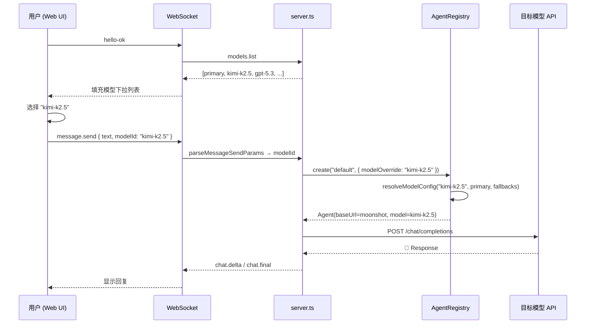

# 大模型运行时切换 — 实现计划方案

> **目标**：让用户可以在对话过程中实时切换 AI 模型，无需重启服务。基于现有 `models.json` 容灾配置体系，在 Web UI 添加模型选择器，用户从预定义模型列表中选择即可切换。

---

## 一、现有架构概述

```
.env.local (环境变量)
    ↓ readEnv()
primaryModelConfig { baseUrl, apiKey, model }
    ↓
~/.belldandy/models.json
    ↓ loadModelFallbacks()
ModelProfile[] (容灾备用模型列表)
    ↓
resolveModelConfig(profileRef, primary, fallbacks)
    ↓
AgentRegistry.create(agentId) → 创建 Agent 实例
```

**核心洞察**：`resolveModelConfig()` 已支持按 `id` 从 `ModelProfile[]` 中查找命名模型，但目前仅被 `AgentProfile.model` 引用，用于容灾场景。我们要做的就是把这个能力暴露给前端用户。

---

## 二、改动范围总览

| # | 文件 | 改动类型 | 说明 |
|---|------|---------|------|
| 1 | `packages/belldandy-agent/src/failover-client.ts` | 修改 | `ModelProfile` 增加 `displayName` 可选字段 |
| 2 | `packages/belldandy-agent/src/agent-registry.ts` | 修改 | 扩展 `create(agentId?, opts?)`，支持 `modelOverride` 透传与缓存隔离 |
| 3 | `packages/belldandy-protocol/src/index.ts` | 修改 | `MessageSendParams` 增加 `modelId?: string` 协议字段 |
| 4 | `packages/belldandy-core/src/server.ts` | 修改 | 新增 `models.list` API；`parseMessageSendParams` 支持 `modelId`；`message.send` 处理模型覆盖 |
| 5 | `packages/belldandy-core/src/bin/gateway.ts` | 修改 | `handleReq` 上下文传入 `modelFallbacks`、`primaryModelConfig`；AgentRegistry 工厂支持模型覆盖 |
| 6 | `apps/web/public/index.html` | 修改 | 添加模型选择器 UI |
| 7 | `apps/web/public/app.js` | 修改 | 加载模型列表、发送消息时附带 `modelId` |
| 8 | `packages/belldandy-core/src/server.test.ts` | 修改/新增用例 | 补充 `models.list` 与 `modelId` 覆盖路径测试 |

---

## 三、详细改动设计

### 3.1 后端：`ModelProfile` 增加 `displayName`

**文件**：[failover-client.ts](file:///e:/project/belldandy/packages/belldandy-agent/src/failover-client.ts)

在 `ModelProfile` 类型中增加可选的 `displayName` 字段，用于前端显示：

```diff
 export type ModelProfile = {
   id?: string;
+  displayName?: string;  // 模型显示名（前端展示用）
   baseUrl: string;
   apiKey: string;
   model: string;
   protocol?: string;
 };
```

`loadModelFallbacks()` 解析时保留 `displayName`：

```diff
 .map((f, i) => ({
   id: f.id ?? `fallback-${i}`,
+  displayName: typeof f.displayName === "string" ? f.displayName : undefined,
   baseUrl: f.baseUrl,
   apiKey: f.apiKey,
   model: f.model,
   protocol: typeof f.protocol === "string" ? f.protocol : undefined,
 }));
```

### 3.2 后端：新增 `models.list` API

**文件**：[server.ts](file:///e:/project/belldandy/packages/belldandy-core/src/server.ts)

在 `handleReq` 的 switch 中新增 `models.list` 分支：

```typescript
case "models.list": {
  // 构建可选模型列表
  const models: Array<{ id: string; displayName: string; model: string }> = [];

  // 1. Primary 模型（来自环境变量）
  if (ctx.primaryModelConfig?.model) {
    models.push({
      id: "primary",
      displayName: `${ctx.primaryModelConfig.model}（默认）`,
      model: ctx.primaryModelConfig.model,
    });
  }

  // 2. models.json 中的备用模型
  for (const fb of ctx.modelFallbacks ?? []) {
    models.push({
      id: fb.id ?? fb.model,
      displayName: fb.displayName ?? fb.model,
      model: fb.model,
    });
  }

  return {
    type: "res", id: req.id, ok: true,
    payload: { models, currentDefault: "primary" },
  };
}
```

**安全说明**：不返回 `apiKey`、`baseUrl` 等敏感字段，仅返回 `id`、`displayName` 和 `model` 名称。

### 3.3 后端：`message.send` 支持 `modelId` 参数

**文件**：[server.ts](file:///e:/project/belldandy/packages/belldandy-core/src/server.ts)

#### 3.3.1 扩展 `parseMessageSendParams`

在约 L1565 处增加 `modelId` 解析：

```diff
  const agentId = typeof obj.agentId === "string" && obj.agentId.trim() ? obj.agentId.trim() : undefined;
+ const modelId = typeof obj.modelId === "string" && obj.modelId.trim() ? obj.modelId.trim() : undefined;

  // ...
- return { ok: true, value: { text, conversationId, from, agentId, attachments, senderInfo, roomContext } };
+ return { ok: true, value: { text, conversationId, from, agentId, modelId, attachments, senderInfo, roomContext } };
```

同时在 `MessageSendParams` 类型中添加 `modelId`。

#### 3.3.2 修改 Agent 创建逻辑

在 `message.send` 的 Agent 创建处（约 L753-763），如果 `modelId` 存在，则解析为具体模型配置并传入 Agent 工厂：

```typescript
const requestedModelId = parsed.value.modelId;

// 创建 Agent 时传入 modelId 覆盖
if (ctx.agentRegistry && requestedAgentId) {
  agent = ctx.agentRegistry.create(requestedAgentId, { modelOverride: requestedModelId });
} else if (ctx.agentRegistry) {
  agent = ctx.agentRegistry.create("default", { modelOverride: requestedModelId });
} else {
  agent = ctx.agentFactory();
}
```

### 3.4 后端：AgentRegistry 工厂支持 `modelOverride`

**文件**：[gateway.ts](file:///e:/project/belldandy/packages/belldandy-core/src/bin/gateway.ts)

修改 `AgentRegistry` 的工厂函数签名，第二参数支持 `modelOverride`：

```typescript
// 原来
const agentRegistry = new AgentRegistry((profile: AgentProfile): BelldandyAgent => {
  const resolved = resolveModelConfig(profile.model, primaryModelConfig, modelFallbacks);
  // ...
});

// 改为
const agentRegistry = new AgentRegistry(
  (profile: AgentProfile, opts?: { modelOverride?: string }): BelldandyAgent => {
    // 模型覆盖：优先使用 modelOverride，否则使用 profile.model
    const modelRef = opts?.modelOverride ?? profile.model;
    const resolved = resolveModelConfig(modelRef, primaryModelConfig, modelFallbacks);
    // ... 后续不变
  }
);
```

> [!IMPORTANT]
> **AgentRegistry 类修改**：需要检查 `AgentRegistry.create()` 方法是否已经支持第二参数透传。如果不支持，需要在 `@belldandy/agent` 包的 `AgentRegistry` 类中扩展 `create(id, opts?)` 签名。

### 3.5 后端：`handleReq` 上下文扩展

**文件**：[server.ts](file:///e:/project/belldandy/packages/belldandy-core/src/server.ts) + [gateway.ts](file:///e:/project/belldandy/packages/belldandy-core/src/bin/gateway.ts)

在 `handleReq` 的 `ctx` 参数中添加：

```typescript
ctx: {
  // ... 现有字段
  primaryModelConfig?: { baseUrl: string; apiKey: string; model: string };
  modelFallbacks?: ModelProfile[];
}
```

在 `gateway.ts` 调用 `startGatewayServer` 时传入这两个字段。

### 3.6 前端：模型选择器 UI

**文件**：[index.html](file:///e:/project/belldandy/apps/web/public/index.html)

在聊天输入区上方或状态栏右侧添加一个下拉选择器：

```html
<!-- 模型选择器 -->
<select id="modelSelect" class="model-select" title="选择模型">
  <option value="">默认模型</option>
</select>
```

样式上使用紧凑的 inline-select 风格，与现有 UI 融合（暗色主题、小字体）。

**文件**：[app.js](file:///e:/project/belldandy/apps/web/public/app.js)

```javascript
// 连接成功后加载模型列表
async function loadModelList() {
  const res = await sendReq({ type: "req", id: makeId(), method: "models.list" });
  if (res?.ok && res.payload?.models) {
    const select = document.getElementById("modelSelect");
    select.innerHTML = '<option value="">默认模型</option>';
    for (const m of res.payload.models) {
      if (m.id === "primary") continue; // 默认模型已在空选项中
      const opt = document.createElement("option");
      opt.value = m.id;
      opt.textContent = m.displayName || m.model;
      select.appendChild(opt);
    }
  }
}

// 在 hello-ok 回调中调用
// loadModelList();

// 发送消息时附带 modelId
const modelSelectEl = document.getElementById("modelSelect");
// 在 sendMessage() 中的 params 对象里添加：
// modelId: modelSelectEl?.value || undefined,
```

---

## 四、`models.json` 配置示例

用户需要在 `~/.belldandy/models.json` 中配置可选模型（此文件已被容灾系统使用，只需确保每个模型有唯一的 `id`）：

```json
{
  "fallbacks": [
    {
      "id": "kimi-k2.5",
      "displayName": "Kimi K2.5 (Moonshot)",
      "baseUrl": "https://api.moonshot.cn/v1",
      "apiKey": "sk-xxx",
      "model": "kimi-k2.5"
    },
    {
      "id": "gpt-5.3",
      "displayName": "GPT-5.3 Codex (中转)",
      "baseUrl": "https://api.aicodewith.com/chatgpt/v1",
      "apiKey": "sk-xxx",
      "model": "gpt-5.3-codex"
    },
    {
      "id": "claude-opus",
      "displayName": "Claude Opus 4.5",
      "baseUrl": "https://api.anthropic.com",
      "apiKey": "sk-ant-xxx",
      "model": "claude-opus-4-5",
      "protocol": "anthropic"
    }
  ]
}
```

---

## 五、数据流示意



---

## 六、风险点与注意事项

| 风险 | 应对 |
|------|------|
| `AgentRegistry.create()` 目前不支持第二参数 | 需要检查并扩展 `@belldandy/agent` 包中的 `AgentRegistry` 类 |
| 不同模型的 `protocol` 不同（openai / anthropic） | `resolveModelConfig` 已返回 `protocol` 字段，Agent 创建时已处理 |
| `models.json` 不存在时 | `loadModelFallbacks` 已兜底返回空数组，前端仅显示默认模型 |
| 模型切换与 AgentRegistry 缓存冲突 | 需将缓存键扩展为 `agentId + modelRef`，或 `modelOverride` 时不走缓存，避免串模型 |
| API Key 泄露风险 | `models.list` API 只返回 `id` + `displayName` + `model`，**不返回 apiKey / baseUrl** |

---

## 七、验证计划

### 7.1 单元测试（可选新增）

项目使用 Vitest，可运行 `npx vitest run` 验证。

- **现有测试**：`packages/belldandy-core/src/server.test.ts` — 覆盖了基础 WebSocket 通信
- **建议新增**：  
  - `parseMessageSendParams` 扩展测试：验证 `modelId` 字段正确解析
  - `models.list` API 返回格式验证

### 7.2 手动验证步骤

1. **准备 `models.json`**：在 `~/.belldandy/models.json` 中按上方示例配置 2-3 个可用模型
2. **启动 Gateway**：在项目根目录执行 `pnpm run dev`（或 `start.bat`）
3. **打开 Web UI**：浏览器访问 `http://localhost:28889`
4. **验证模型列表加载**：
   - 连接成功后，观察模型选择器是否正确显示所有配置的模型
   - 检查浏览器开发者工具的 Network/Console，确认 `models.list` 请求返回正确数据
5. **验证模型切换**：
   - 选择一个非默认模型（如 Kimi K2.5）
   - 发送一条消息，观察是否能成功响应
   - 查看服务端日志，确认使用的是选定模型的 API 端点
6. **验证默认模型**：
   - 将选择器切回"默认模型"
   - 发送消息，确认使用环境变量配置的默认模型
7. **边界情况**：
   - `models.json` 文件不存在时，选择器应只显示"默认模型"
   - 选择器选了一个 `id` 在 `models.json` 中已被删除的模型，应 fallback 到默认

---

## 八、后续扩展（非本次范围）

- 记住用户上次选择的模型（localStorage）
- 按对话维度绑定模型（同一对话始终使用同一模型）
- 「模型 × Agent」二维选择矩阵
- 模型使用统计和费用展示

---

## 九、实施计划（按当前代码现状）

1. **数据契约先行**
   - 修改 `ModelProfile` 支持 `displayName?`
   - 修改协议 `MessageSendParams` 支持 `modelId?`
   - 验证：`@belldandy/agent`、`@belldandy/protocol` 构建通过

2. **扩展 AgentRegistry（核心）**
   - 扩展工厂签名：`(profile, opts?)`
   - 扩展创建签名：`create(agentId?, opts?)`
   - 处理缓存隔离：按 `agentId + modelRef` 缓存，或覆盖模型时禁用缓存
   - 验证：新增/调整 registry 单测，覆盖默认模型与覆盖模型两种路径

3. **Gateway 注入模型上下文**
   - 在 `startGatewayServer(...)` 入参加入：
     - `primaryModelConfig`
     - `modelFallbacks`
   - 验证：server 层可拿到完整模型信息用于 `models.list`

4. **Server 增加 `models.list` + `message.send.modelId`**
   - `DEFAULT_METHODS` 增加 `models.list`
   - `handleReq` 新增 `models.list` 分支（严格脱敏）
   - `parseMessageSendParams` 解析 `modelId`
   - `message.send` 调用 `agentRegistry.create(agentId, { modelOverride })`
   - 验证：无效 `modelId` 时回退默认模型，不抛异常

5. **前端接入模型选择器**
   - `index.html` 增加 `modelSelect`
   - `app.js` 在 `hello-ok` 后拉取 `models.list`
   - `sendMessage()` 附加 `modelId`
   - 验证：切换模型后消息正常返回，切回默认模型仍可用

6. **测试与回归**
   - 扩展 `server.test.ts`：
     - `models.list` 返回结构与脱敏验证
     - `message.send` 带 `modelId` 的覆盖路径
     - 不存在 `modelId` 的 fallback 行为
   - 手测按第七节流程执行一轮

---

## 十、补充范围与修正点

### 10.1 相对原方案新增的必改文件

- `packages/belldandy-protocol/src/index.ts`
  - 原方案提到“MessageSendParams 增加 modelId”，但未在文件范围中列出，实际必须同步修改协议定义。
- `packages/belldandy-agent/src/agent-registry.ts`
  - 原方案提到“需要确认 create() 是否支持第二参数”，现状确认为**不支持**，需正式纳入改动范围。

### 10.2 默认模型判定修正

- 原方案中 `models.list` 示例将 `currentDefault` 固定为 `"primary"`。
- 现状下 `default` Agent 可被 `agents.json` 覆盖，其 `model` 可能不是 `primary`。
- 因此应改为：
  - 以 `default` Agent Profile 的 `model` 作为默认模型引用；
  - 前端“默认模型”文案与该引用一致（而不是写死 primary）。

### 10.3 缓存行为修正

- 原方案默认“每次请求创建新 Agent 实例”不符合现状。
- 现状 `AgentRegistry` 会缓存实例；若不改缓存键，模型覆盖将可能命中旧实例导致切换失效。
- 必须在实施时完成缓存策略修正（见第九节第 2 点）。

---

## 十一、完成进度说明（2026-03-03）

### 11.1 实施状态

- [x] `ModelProfile` 增加 `displayName`，并在 `loadModelFallbacks()` 保留解析
- [x] `MessageSendParams` 增加 `modelId?: string`
- [x] `AgentRegistry.create(agentId?, opts?)` 支持 `modelOverride` 透传
- [x] `AgentRegistry` 缓存策略改为按 `agentId + modelRef` 隔离
- [x] `server.ts` 新增 `models.list`，并返回 `currentDefault`
- [x] `message.send` 支持 `modelId`，透传到 `agentRegistry.create(..., { modelOverride })`
- [x] `gateway.ts` 已注入 `primaryModelConfig` 与 `modelFallbacks` 到 server 上下文
- [x] Web UI 已新增模型选择器，`hello-ok` 后加载 `models.list`，发送消息附带 `modelId`
- [x] 新增/更新测试：`agent-registry.test.ts`、`server.test.ts`

### 11.2 验证结果

- 构建验证：`corepack pnpm build` 通过
- 定向测试：
  - `node .\node_modules\vitest\vitest.mjs run packages/belldandy-agent/src/agent-registry.test.ts packages/belldandy-core/src/server.test.ts`
  - 结果：`2 files, 16 tests passed`

### 11.3 产物与说明

- 已同步生成并更新对应 `dist` 产物（`build` 后自动生成）
- 测试日志中存在一条既有 `ENOENT` stderr 输出（历史测试路径时序问题），未导致测试失败，当前用例全部通过

## 小结
改动概要：

8 个文件进入改动范围（含协议与测试）
新增 `models.list` API（安全返回模型列表，不暴露密钥）
`message.send` 增加 `modelId` 参数，Agent 创建时按需切换模型
Web UI 添加模型下拉选择器
`AgentRegistry` 扩展 `modelOverride` 并修正缓存策略，确保运行时切换真实生效
